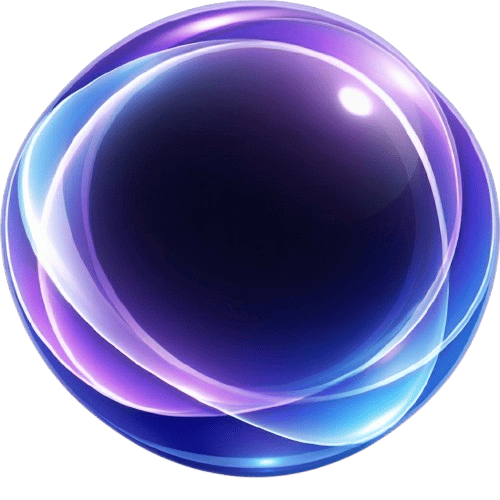
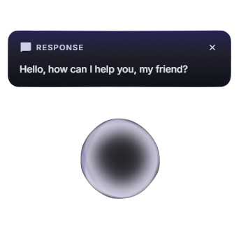

<p align="center">
  
</p>

<h1 align="center">Atlas</h1>

<p align="center">
  <b>AI agent that lives on your desktop.</b><br/>
  It sees your screen, understands what you need, and gets things done — hands-free.
</p>

<p align="center">
  <a href="https://github.com/dortanes/atlas/releases"></a>&nbsp;
  <a href="#-getting-started"></a>&nbsp;
  <a href="LICENSE"></a>
</p>

<p align="center">
  
  
  
</p>

<p align="center"></p>

---

> **⚠️ Atlas is in active development (v0.2.0).**
> 
> - 🤖 **LLM support:** Gemini (including native [Computer Use API](https://ai.google.dev/gemini-api/docs/computer-use)) and OpenAI. More providers on the way.
> - 🖥 **Screen control:** Gemini 3.x models use native [Computer Use API](https://ai.google.dev/gemini-api/docs/computer-use) for precise actions. Older models use vision-based coordinate prediction.
> - 💻 **Platform:** Windows only for now. macOS & Linux support is planned.
> - 🐛 **Found a bug?** We'd love to hear about it — [open an issue](https://github.com/dortanes/atlas/issues).

---

## What is Atlas?

Atlas is an **AI-powered desktop agent** that works alongside you as a transparent overlay. Press `Ctrl+Space`, tell it what to do — and it figures out the rest: navigating apps, clicking buttons, typing text, searching the web, finding files, running commands.

Think of it as a **copilot for your entire OS**.

- 🖥 **Sees your screen** — captures what's on your display and understands the context
- 🧠 **Thinks before it acts** — plans multi-step tasks and shows progress in real time
- 🖱 **Controls your computer** — mouse, keyboard, and terminal — all automated
- 🔍 **Searches the web** — finds answers and brings them back, no tab-switching needed
- 📂 **Finds your files** — searches local files and folders by name, right from chat
- 🗣 **Speaks to you** — real-time voice responses with streaming TTS
- 🔊 **Sound feedback** — distinct sounds for every state: activation, processing, task complete, warnings
- 🛡 **Asks before doing anything risky** — built-in safety system with permission prompts

---

## ✨ Key Features

### 🔮 The Orb
A glowing AI indicator that shows you exactly what Atlas is doing — idle, thinking, acting, or waiting for your input. Always visible, never in the way.

### 🏝 Islands
Context-aware floating panels that appear when relevant:
- **Action Island** — shows the current task and progress
- **Response Island** — streams Atlas's thoughts and replies word by word
- **Permission Island** — asks for confirmation before risky operations
- **Microtask Island** — your task queue with real-time step progress (queue new tasks while the agent is busy)
- **Search Island** — web search results and local file search results
- **Warning Island** — dismissable warnings for errors and quota issues

### 🖥 Computer Use
Atlas supports the native **Gemini [Computer Use API](https://ai.google.dev/gemini-api/docs/computer-use)** — when using compatible models (Gemini 3.x), it gets pixel-perfect screen control with built-in tool calls for clicking, typing, scrolling, and navigating. Older models fall back to vision-based coordinate prediction.

### 🧩 Smart Task Planning
Before executing complex commands, Atlas breaks them into high-level steps (2–5) and displays them in the Task Queue. You see planned steps before execution begins and watch progress as each step completes.

### 🎭 Personas
Create multiple AI agents with unique personalities, knowledge, and voices. Each persona has its own memory and prompt settings — switch between them from the tray menu.

### 🧠 Memory
Atlas remembers your preferences and context across sessions. It learns facts about you from conversations and uses them to give better responses over time. Browse conversation history and view, edit, or delete learned facts in Settings.

### ✍️ Editable Prompts
Full control over the AI's behavior — modify system, action, and safety prompts directly from the Settings UI. Reset to defaults anytime.

### ⚙️ Customizable Layout
Choose where Atlas appears on screen (left, right, or center) and configure your preferred activation hotkey — all from Settings.

### 🔧 Debug Logging
Enable per-request session logs to trace the full pipeline: intent classification → LLM calls → actions → response streaming — with precise timing for every stage.

---

## 🚀 Getting Started

### Download & Install

1. Go to [**Releases**](https://github.com/dortanes/atlas/releases) and download the latest installer for Windows
2. Run the installer — Atlas will appear in your system tray
3. Get a **Gemini API key**: go to [Google AI Studio](https://aistudio.google.com/apikey) → sign in → **Create API Key** → copy it
4. Click the **Atlas tray icon** → **Settings** → **LLM** tab → paste your API key
5. *(Optional)* For voice output: get an [ElevenLabs](https://elevenlabs.io/) API key → **TTS** tab → paste key + voice ID
6. Press `Ctrl+Space` and start giving Atlas tasks 🎉

### Build from Source

> For contributors and developers who want to run Atlas from source.

```bash
git clone https://github.com/dortanes/atlas.git
cd atlas
yarn install
yarn dev
```

> **Requires:** [Node.js](https://nodejs.org/) ≥ 20 · [Yarn](https://yarnpkg.com/) ≥ 1.22

---

## 🗺 Roadmap

| Status | Feature |
|:------:|---------|
| ✅ | Transparent glassmorphism overlay with Orb + Island UI |
| ✅ | LLM integration (Gemini + OpenAI) with multi-provider architecture |
| ✅ | Screen vision + desktop automation (robotjs) |
| ✅ | Native Gemini [Computer Use API](https://ai.google.dev/gemini-api/docs/computer-use) |
| ✅ | Smart task planning with step-by-step progress |
| ✅ | Streaming TTS via ElevenLabs |
| ✅ | Persona system with isolated memory & custom voices |
| ✅ | Web search + local file search |
| ✅ | Settings UI with prompt editor + debug logging |
| ✅ | Intent classification (direct / action / chat) |
| 🔜 | Voice input (wake word + STT) |
| 🔜 | Action whitelist/blacklist & audit log |
| 🔜 | Context caching (token optimization) |
| 🔜 | Onboarding flow |
| 🔜 | Auto-update |

---

## 🤝 Contributing

Contributions are welcome! Feel free to open an issue or submit a pull request.

## 📜 License

[Apache License 2.0](LICENSE) — use it, modify it, build on it.

---

<p align="center">
  Vibecoded with ❤️ by <a href="https://github.com/dortanes">dortanes</a>
</p>